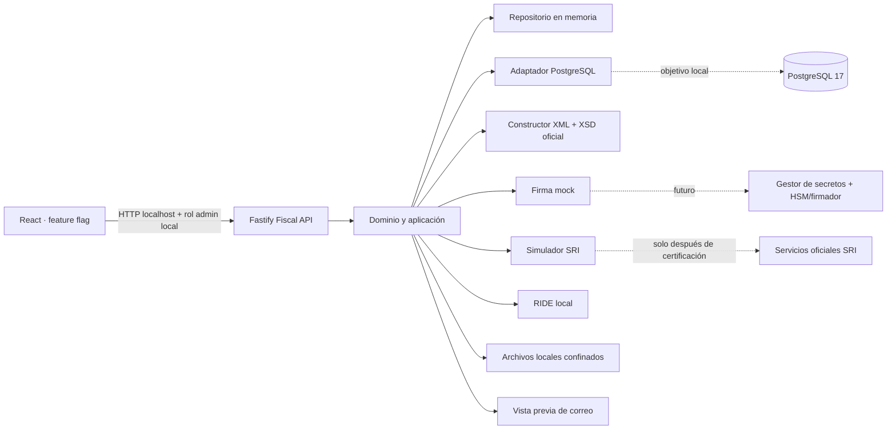

# Arquitectura de facturación electrónica local

## Arquitectura actual protegida

La aplicación React existente sigue consumiendo Apps Script mediante su proxy para los módulos operativos. Inscripciones, pagos, certificados académicos, QR, avales y reportes por vendedor no se migraron ni se reescribieron. La única integración es un acceso administrativo condicionado por `VITE_ENABLE_SRI_BILLING` y un icono opcional que navega al módulo sin transferir datos.

## Arquitectura fiscal propuesta

La API orquesta reglas y transiciones. El frontend nunca calcula la verdad fiscal ni genera una firma. Los constructores XML, el algoritmo de clave, la exactitud monetaria y la secuencia viven en el servicio. El repositorio conserva el documento, detalle, impuestos, pagos, referencias de notas de crédito, transmisiones y eventos.

## Límites de confianza

| Zona | Confianza actual | Control |
|---|---|---|
| Navegador | No confiable | Zod en API, recálculo con `decimal.js`, rol local solo para demo |
| API fiscal | Proceso local | Loopback, CORS localhost, límites de cuerpo, cabeceras seguras, logs redactados |
| PostgreSQL | Persistencia objetivo local | Restricciones, unicidad, transacción y `SELECT FOR UPDATE` |
| Sistema de archivos | Solo demo | Raíz fija, nombres controlados, protección contra traversal |
| Firma | No confiable para tributos | Adaptador mock inequívoco; no acepta certificados |
| SRI | No existe conexión | Gateway simulado; gateway oficial deshabilitado por diseño |
| Correo | No existe envío | Solo archivo de vista previa local |

## Componentes

- **Frontend:** tablero, filtros, inscripciones ficticias, formulario, detalle, stepper, auditoría, XML y descargas. Solo administrador y feature flag.
- **API:** Fastify sobre `127.0.0.1:4010`, JSON de error uniforme, correlación, idempotencia y OpenAPI.
- **Base:** migración SQL para PostgreSQL; modo memoria aislado para demostrar cuando Docker falta.
- **Almacenamiento:** artefactos por documento bajo `fiscal-service/var`; contrato reemplazable por objeto cifrado futuro.
- **Firma:** comentario mock no criptográfico. La interfaz futura no permite guardar la clave privada en base de datos.
- **SRI:** simulador determinista con escenarios. Las URL oficiales solo están documentadas y nunca se invocan.
- **Auditoría:** evento por transición y transmisión con hash SHA-256, intento, respuesta y marcas de tiempo.
- **Correo:** generación local de vista previa; sin SMTP ni API externa.

## Por qué no Apps Script

La firma XAdES, custodia de claves, transacciones de secuenciales, reintentos, almacenamiento inmutable, trazabilidad y controles de acceso requieren un límite de seguridad y persistencia que no debe mezclarse con el Apps Script operativo. Separar el servicio reduce impacto sobre Inscripciones y permite desplegar, certificar, auditar y revertir el componente fiscal de forma independiente.
