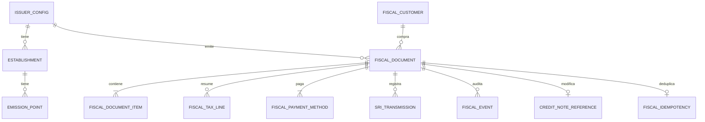

# Modelo de dominio fiscal

## Entidades y relaciones

- `IssuerConfig` posee `Establishment`; cada establecimiento posee `EmissionPoint`.
- `Sequence` identifica tipo de documento + establecimiento + punto de emisión y reserva un número de nueve dígitos.
- `FiscalCustomer` representa la instantánea fiscal del comprador y puede referenciar un participante ficticio.
- `FiscalDocument` representa factura o nota de crédito y contiene `FiscalDocumentItem`, `FiscalTaxLine` y `FiscalPaymentMethod`.
- `CreditNoteReference` enlaza una nota de crédito con una factura autorizada sin mutarla.
- `SriTransmission` conserva fase, intento, hash y respuesta simulada.
- `FiscalEvent` forma la bitácora inmutable de cambios.
- `CertificateMetadata` guarda metadatos y una referencia futura a secretos, nunca la clave privada.
- `FiscalIdempotency` enlaza una clave de solicitud con el recurso ya creado.

## Estados

`DRAFT → VALIDATED → SIGNED_MOCK → PENDING_SUBMISSION → SUBMITTED → RECEIVED/PROCESSING → AUTHORIZED`.

Ramas controladas: `VALIDATION_FAILED`, `RETURNED`, `NOT_AUTHORIZED`, `RETRY_PENDING` y `ERROR`. Una transición fuera de la tabla del dominio se rechaza. Una corrección de devuelto/no autorizado vuelve a borrador conservando la identidad lógica; los reintentos no generan otra factura.

## Invariantes

1. El backend recalcula cantidades, descuentos, bases, impuestos y total con `decimal.js`; no confía en el navegador.
2. Una inscripción fuente solo origina una factura; una clave de acceso es única.
3. La combinación documento/establecimiento/punto/secuencial es única.
4. PostgreSQL reserva secuencias dentro de una transacción y bloquea la fila con `FOR UPDATE`.
5. El pago de la fuente debe estar verificado y los datos mínimos completos.
6. La nota de crédito solo nace de una factura autorizada; el valor no supera el total acreditable.
7. Los comprobantes no se eliminan. Las correcciones se auditan y una anulación interna es un estado, no un `DELETE`.
8. XML sin firma, XML mock, XML autorizado simulado y RIDE son archivos separados.
9. La firma mock no puede confundirse con XAdES ni habilitar el gateway oficial.

## Conceptos que no deben confundirse

| Concepto | Finalidad | Autoridad |
|---|---|---|
| Inscripción | Relación de una persona con un curso | Módulo operativo existente |
| Ingreso | Registro financiero interno | Módulo de ingresos existente |
| Pago | Evidencia/estado de cobro | Flujo actual de pagos |
| Factura | Documento tributario con secuencia, clave, XML y estado | Nuevo dominio fiscal separado |

En esta prueba, las inscripciones son fixtures explícitamente ficticios. No hay lectura de Google Sheets ni sincronización productiva.
